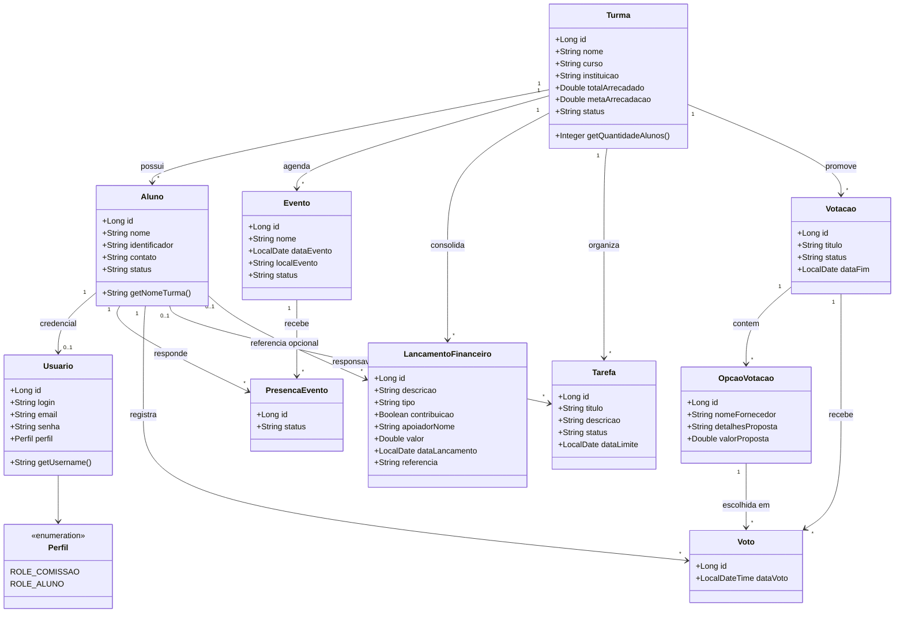

# Diagrama de Classes

Este documento foi atualizado com base nas classes reais do projeto em
`src/main/java`. Ele traz duas visoes:

- dominio, com as entidades persistidas;
- aplicacao, com controllers, services, repositories e DTOs principais.

Arquivos-fonte:

- `diagramas/diagrama-classes.mmd`

## 1. Diagrama de classes do dominio

## 2. Diagrama de classes da aplicacao

```mermaid
classDiagram
    class AuthController
    class ContaController
    class CadastroController
    class DashboardController
    class ContribuicaoController
    class RelatorioFinanceiroController
    class AlunoPortalController
    class PresencaEventoController
    class VotacaoSeguraController

    class AutenticacaoService
    class TokenService
    class RelatorioFinanceiroService
    class SecurityFilter
    class SecurityConfig

    class AlunoRepository
    class TurmaRepository
    class EventoRepository
    class LancamentoRepository
    class TarefaRepository
    class UsuarioRepository
    class VotacaoRepository
    class VotoRepository
    class PresencaEventoRepository
    class OpcaoVotacaoRepository

    class AlunoPainelResponseDTO
    class DashboardResumoDTO
    class ContribuicaoResumoDTO
    class RelatorioFinanceiroDTO
    class UsuarioLogadoResponseDTO
    class AlunoInputDTO
    class EventoInputDTO
    class LancamentoInputDTO
    class ContribuicaoInputDTO
    class VotacaoInputDTO
    class ConfirmacaoPresencaDTO
    class VotoAlunoLogadoRequestDTO

    AuthController --> TokenService
    ContaController --> UsuarioLogadoResponseDTO

    CadastroController --> TurmaRepository
    CadastroController --> AlunoRepository
    CadastroController --> EventoRepository
    CadastroController --> LancamentoRepository
    CadastroController --> TarefaRepository
    CadastroController --> VotacaoRepository
    CadastroController --> OpcaoVotacaoRepository
    CadastroController --> VotoRepository
    CadastroController --> UsuarioRepository
    CadastroController --> AlunoInputDTO
    CadastroController --> EventoInputDTO
    CadastroController --> LancamentoInputDTO
    CadastroController --> VotacaoInputDTO

    DashboardController --> DashboardResumoDTO
    DashboardController --> AlunoRepository
    DashboardController --> TurmaRepository
    DashboardController --> EventoRepository
    DashboardController --> LancamentoRepository
    DashboardController --> VotacaoRepository

    ContribuicaoController --> ContribuicaoInputDTO
    ContribuicaoController --> ContribuicaoResumoDTO
    ContribuicaoController --> TurmaRepository
    ContribuicaoController --> AlunoRepository
    ContribuicaoController --> LancamentoRepository

    RelatorioFinanceiroController --> RelatorioFinanceiroService
    RelatorioFinanceiroController --> RelatorioFinanceiroDTO

    AlunoPortalController --> AlunoPainelResponseDTO
    AlunoPortalController --> AlunoRepository
    AlunoPortalController --> EventoRepository
    AlunoPortalController --> LancamentoRepository
    AlunoPortalController --> PresencaEventoRepository
    AlunoPortalController --> VotacaoRepository
    AlunoPortalController --> VotoRepository

    PresencaEventoController --> ConfirmacaoPresencaDTO
    PresencaEventoController --> EventoRepository
    PresencaEventoController --> PresencaEventoRepository

    VotacaoSeguraController --> VotoAlunoLogadoRequestDTO
    VotacaoSeguraController --> VotacaoRepository
    VotacaoSeguraController --> OpcaoVotacaoRepository
    VotacaoSeguraController --> VotoRepository

    SecurityFilter --> TokenService
    SecurityFilter --> UsuarioRepository
    SecurityConfig --> SecurityFilter
    AutenticacaoService --> UsuarioRepository
    RelatorioFinanceiroService --> TurmaRepository
    RelatorioFinanceiroService --> AlunoRepository
    RelatorioFinanceiroService --> LancamentoRepository
```

## Leitura pratica

### Nucleo do dominio

`Turma` continua sendo o centro do sistema. Alunos, eventos, votacoes,
lancamentos, tarefas e indicadores financeiros se organizam a partir dela.

### Identidade e acesso

`Usuario` faz a ponte entre autenticacao e dominio. O acesso pode representar:

- um aluno autenticado, quando existe vinculo com `Aluno`;
- um usuario de comissao, quando o perfil e administrativo.

### Financeiro atualizado

O modelo financeiro atual nao trata apenas receitas e despesas genericas.
`LancamentoFinanceiro` agora suporta:

- marcacao de contribuicao;
- nome do apoiador;
- referencia textual para mensagem ou observacao.

Isso sustenta os modulos de contribuicoes e relatorios financeiros.

### Participacao do aluno

O aluno interage diretamente com dois agregados operacionais:

- `PresencaEvento`, para confirmacao de presenca;
- `Voto`, para voto seguro nas enquetes.

### Capacidade de evolucao

`Tarefa` segue modelada no backend, mesmo sem um modulo de interface completo.
Isso permite ampliar a operacao da comissao sem remodelar o banco.
