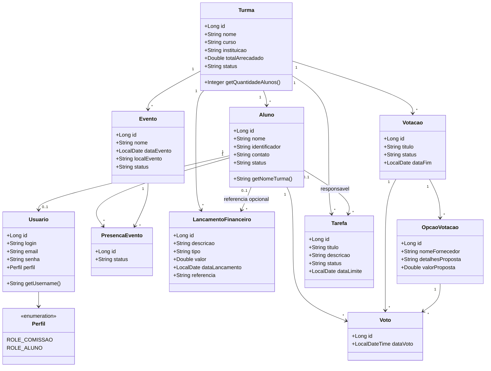

# Diagrama de Classes

Este documento apresenta duas visoes:

- visao de dominio, focada nas entidades de negocio;
- visao de aplicacao, focada nos componentes de autenticacao, controllers e persistencia.

O arquivo fonte em Mermaid esta em `diagramas/diagrama-classes.mmd`.

## 1. Diagrama de classes do dominio

## 2. Diagrama de classes da aplicacao

```mermaid
classDiagram
    class AuthController
    class ContaController
    class CadastroController
    class DashboardController
    class AlunoPortalController
    class PresencaEventoController
    class VotacaoSeguraController

    class AutenticacaoService
    class TokenService
    class SecurityFilter
    class SecurityConfig

    class AlunoRepository
    class TurmaRepository
    class EventoRepository
    class LancamentoRepository
    class UsuarioRepository
    class VotacaoRepository
    class VotoRepository
    class PresencaEventoRepository
    class OpcaoVotacaoRepository

    class DashboardResumoDTO
    class AlunoPainelResponseDTO
    class UsuarioLogadoResponseDTO

    AuthController --> TokenService
    ContaController --> UsuarioLogadoResponseDTO
    CadastroController --> AlunoRepository
    CadastroController --> TurmaRepository
    CadastroController --> EventoRepository
    CadastroController --> LancamentoRepository
    CadastroController --> VotacaoRepository
    CadastroController --> VotoRepository
    CadastroController --> UsuarioRepository
    DashboardController --> DashboardResumoDTO
    DashboardController --> AlunoRepository
    DashboardController --> TurmaRepository
    DashboardController --> EventoRepository
    DashboardController --> LancamentoRepository
    DashboardController --> VotacaoRepository
    AlunoPortalController --> EventoRepository
    AlunoPortalController --> VotacaoRepository
    AlunoPortalController --> PresencaEventoRepository
    AlunoPortalController --> VotoRepository
    AlunoPortalController --> AlunoPainelResponseDTO
    PresencaEventoController --> EventoRepository
    PresencaEventoController --> PresencaEventoRepository
    VotacaoSeguraController --> VotacaoRepository
    VotacaoSeguraController --> VotoRepository
    VotacaoSeguraController --> OpcaoVotacaoRepository
    SecurityFilter --> TokenService
    SecurityFilter --> UsuarioRepository
    SecurityConfig --> SecurityFilter
    AutenticacaoService --> UsuarioRepository
```

## Interpretacao pratica

### Nucleo do dominio

O centro do sistema e a entidade `Turma`.
Quase todos os elementos operacionais da formatura nascem dela:

- alunos;
- eventos;
- lancamentos;
- votacoes;
- tarefas.

### Controle de acesso

`Usuario` faz a ponte entre autenticacao e negocio.
Quando o usuario representa um aluno, ele se vincula a `Aluno`.
Quando representa a comissao, pode existir sem vinculo direto com aluno.

### Participacao do aluno

O aluno participa do sistema por dois caminhos principais:

- `PresencaEvento`
- `Voto`

Isso permite medir engajamento, tomada de decisao e preparacao dos eventos.

### Base para crescimento

A presenca da classe `Tarefa` mostra que o dominio ja esta pronto para crescer
em direcao a um modulo de operacao e pendencias, mesmo antes da tela existir.
