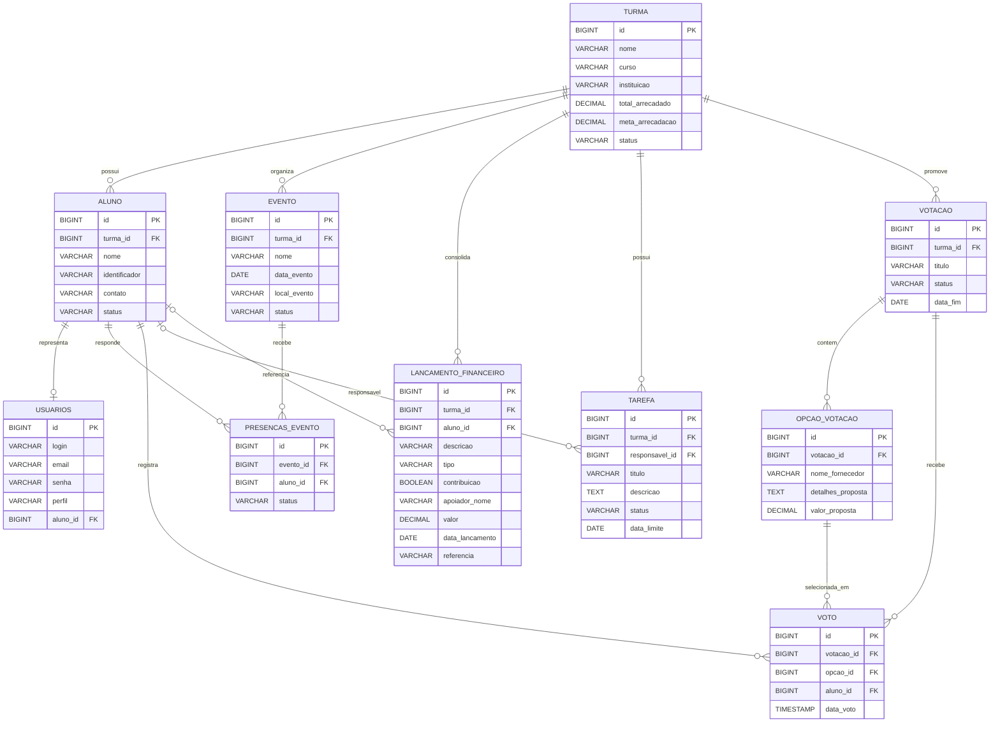

# Modelo de Dados

Este documento consolida o modelo entidade-relacionamento e o modelo relacional
logico do projeto com base nas entidades JPA atuais em `src/main/java/.../model`.

Arquivos de apoio:

- `diagramas/modelo-relacional-drawsql.mmd`
- `diagramas/schema-drawsql.sql`

## Visao geral

### Identidade e acesso

- `usuarios`

### Nucleo academico e operacional

- `turma`
- `aluno`
- `evento`
- `presencas_evento`
- `tarefa`

### Financeiro e contribuicoes

- `lancamento_financeiro`

### Decisao coletiva

- `votacao`
- `opcao_votacao`
- `voto`

## DER atualizado

## Visao relacional resumida

### Chaves principais

- `turma.id`
- `aluno.id`
- `usuarios.id`
- `evento.id`
- `presencas_evento.id`
- `lancamento_financeiro.id`
- `tarefa.id`
- `votacao.id`
- `opcao_votacao.id`
- `voto.id`

### Principais chaves estrangeiras

- `aluno.turma_id -> turma.id`
- `usuarios.aluno_id -> aluno.id`
- `evento.turma_id -> turma.id`
- `presencas_evento.evento_id -> evento.id`
- `presencas_evento.aluno_id -> aluno.id`
- `lancamento_financeiro.turma_id -> turma.id`
- `lancamento_financeiro.aluno_id -> aluno.id`
- `tarefa.turma_id -> turma.id`
- `tarefa.responsavel_id -> aluno.id`
- `votacao.turma_id -> turma.id`
- `opcao_votacao.votacao_id -> votacao.id`
- `voto.votacao_id -> votacao.id`
- `voto.opcao_id -> opcao_votacao.id`
- `voto.aluno_id -> aluno.id`

## Dicionario resumido

### turma

Representa a unidade principal de organizacao da formatura.
Tudo o que importa para o negocio e agrupado por turma.
Tambem guarda `totalArrecadado` e `metaArrecadacao`.

### aluno

Representa o formando participante da turma.
Carrega dados pessoais basicos, identificador unico e status.

### usuarios

Representa a identidade de acesso.
Pode apontar para um aluno ou existir como usuario administrativo.

### evento

Representa reunioes, ensaios, cerimonias ou marcos da jornada da formatura.

### presencas_evento

Representa a resposta do aluno para um evento.
Hoje o sistema trabalha com foco em confirmacao de presenca.

### lancamento_financeiro

Representa entrada ou saida financeira vinculada a uma turma.
Pode opcionalmente referenciar um aluno.
No modelo atual tambem registra:

- se o item e uma contribuicao;
- quem foi o apoiador;
- uma referencia ou mensagem.

### tarefa

Representa pendencia operacional com prazo e responsavel.
Ja existe no dominio, mas ainda carece de modulo visual completo.

### votacao

Representa uma enquete ou decisao da turma.

### opcao_votacao

Representa cada proposta/opcao disponivel na votacao.

### voto

Representa a escolha efetiva do aluno em uma votacao.

## Restricoes relevantes

- `aluno.identificador` deve ser unico;
- `usuarios.login` deve ser unico;
- `usuarios.email` deve ser unico;
- `usuarios.aluno_id` deve ser unico para manter o vinculo um-para-um;
- `voto` deve ser unico por par `votacao_id` + `aluno_id`;
- `evento`, `lancamento_financeiro`, `votacao` e `tarefa` dependem de `turma`.

## Observacao sobre nomenclatura fisica

Alguns nomes de tabela podem variar conforme a estrategia de naming do Hibernate,
mas o modelo acima representa a estrutura logica recomendada para documentacao,
drawSQL e alinhamento de negocio.
