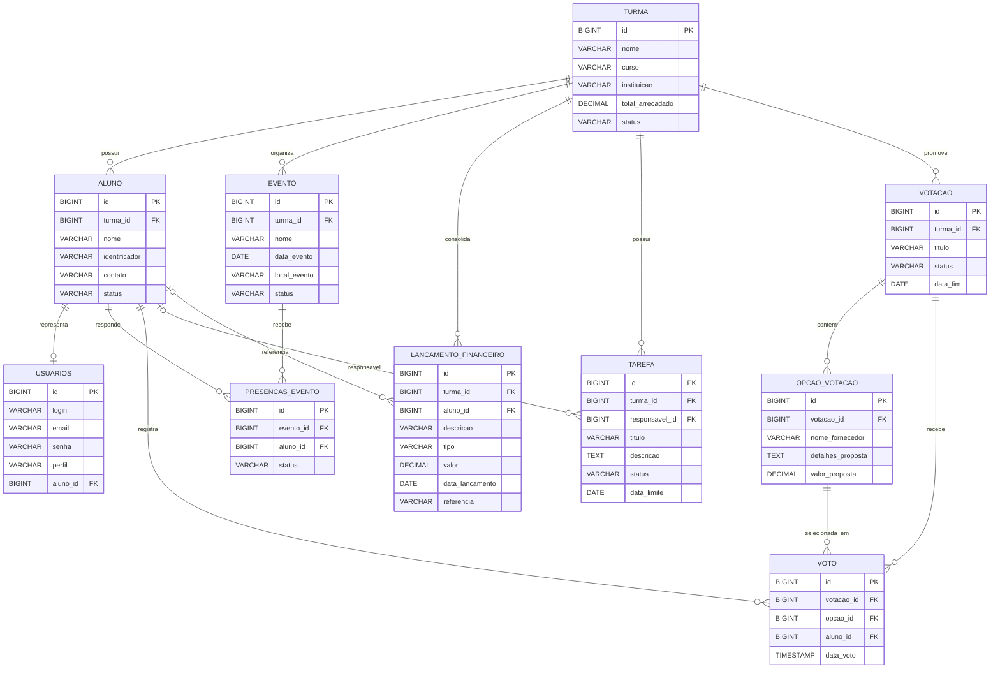

# Modelo de Dados

Este documento descreve o modelo relacional do sistema.
O diagrama foi organizado para ficar proximo ao estilo visual visto na referencia
da imagem anexada, com foco em tabelas, chaves e relacionamentos.

Arquivos de apoio:

- `diagramas/modelo-relacional-drawsql.mmd`
- `diagramas/schema-drawsql.sql`

## Visao geral das entidades

### Tabelas de identidade e acesso

- `usuarios`

### Tabelas de dominio academico e operacional

- `turma`
- `aluno`
- `evento`
- `presencas_evento`
- `tarefa`

### Tabelas de dominio financeiro

- `lancamento_financeiro`

### Tabelas de decisao e votacao

- `votacao`
- `opcao_votacao`
- `voto`

## DER em Mermaid

## Dicionario resumido

### turma

Representa a unidade principal de organizacao da formatura.
Tudo o que importa para o negocio e agrupado por turma.

### aluno

Representa o formando participante da turma.
Carrega dados pessoais basicos e status financeiro.

### usuarios

Representa a identidade de acesso.
Pode apontar para um aluno ou existir como usuario administrativo.

### evento

Representa reunioes, ensaios, cerimonias ou marcos da jornada da formatura.

### presencas_evento

Representa a resposta do aluno para um evento.
Hoje o sistema trabalha com foco em confirmacao de presenca.

### lancamento_financeiro

Representa entrada ou saida financeira vinculada a uma turma.
Pode opcionalmente referenciar um aluno.

### tarefa

Representa pendencia operacional com prazo e responsavel.
Ja existe no dominio, mas ainda carece de modulo visual completo.

### votacao

Representa uma enquete ou decisao da turma.

### opcao_votacao

Representa cada proposta/opcao disponivel na votacao.

### voto

Representa a escolha efetiva do aluno em uma votacao.

## Restricoes relevantes

- `aluno.identificador` deve ser unico;
- `usuarios.login` deve ser unico;
- `usuarios.email` deve ser unico;
- `voto` deve ser unico por par `votacao_id` + `aluno_id`;
- `evento`, `lancamento_financeiro`, `votacao` e `tarefa` dependem de `turma`.

## Observacao sobre nomenclatura fisica

Alguns nomes de tabela podem variar conforme a estrategia de naming do Hibernate,
mas o modelo acima representa a estrutura logica recomendada para documentacao,
drawSQL e alinhamento de negocio.
