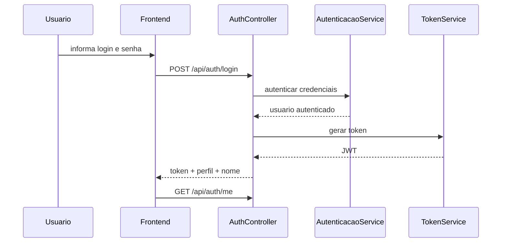
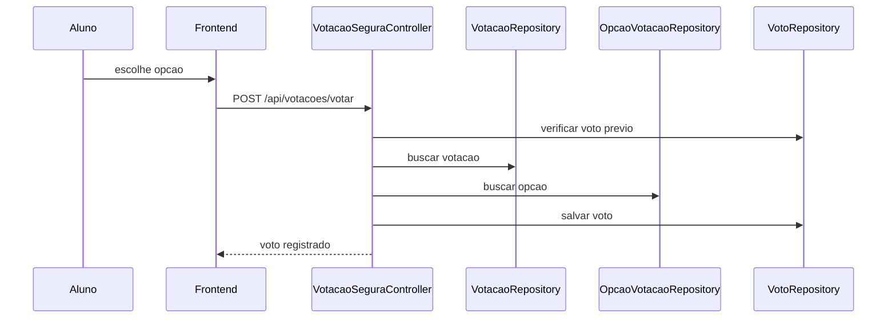
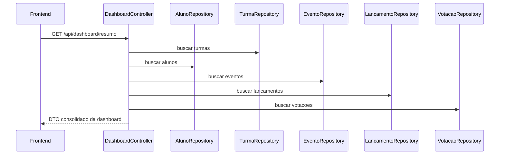
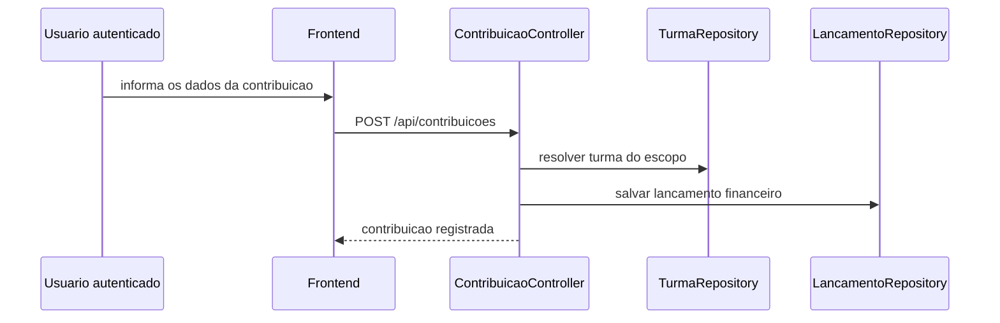
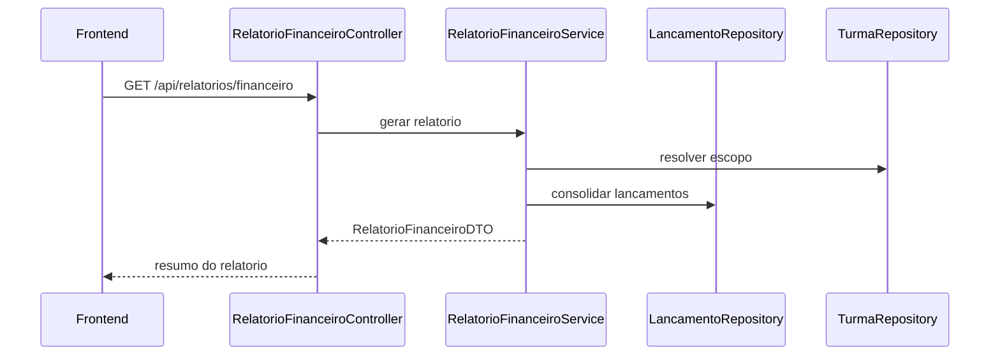

# API e Fluxos Principais

## Convencoes gerais

- base path da API: `/api`
- autenticacao: `Authorization: Bearer <token>`
- perfis principais:
  `ROLE_COMISSAO` e `ROLE_ALUNO`

## Endpoints de autenticacao

| Metodo | Rota | Objetivo | Acesso |
| --- | --- | --- | --- |
| POST | `/api/auth/login` | Autenticar usuario e emitir JWT | Publico |
| GET | `/api/auth/me` | Consultar usuario autenticado | Autenticado |

## Endpoints administrativos

### Turmas

| Metodo | Rota |
| --- | --- |
| GET | `/api/cadastro/turmas` |
| POST | `/api/cadastro/turma` |
| PUT | `/api/cadastro/turma/{id}` |
| DELETE | `/api/cadastro/turma/{id}` |

### Alunos

| Metodo | Rota |
| --- | --- |
| GET | `/api/cadastro/alunos` |
| POST | `/api/cadastro/aluno` |
| PUT | `/api/cadastro/aluno/{id}` |
| DELETE | `/api/cadastro/aluno/{id}` |
| POST | `/api/cadastro/alunos/importar` |

### Eventos

| Metodo | Rota |
| --- | --- |
| GET | `/api/cadastro/eventos` |
| POST | `/api/cadastro/evento` |
| PUT | `/api/cadastro/evento/{id}` |
| DELETE | `/api/cadastro/evento/{id}` |

### Financeiro

| Metodo | Rota |
| --- | --- |
| GET | `/api/cadastro/financeiro` |
| POST | `/api/cadastro/lancamento` |
| PUT | `/api/cadastro/lancamento/{id}` |
| DELETE | `/api/cadastro/lancamento/{id}` |

### Votacoes

| Metodo | Rota |
| --- | --- |
| GET | `/api/cadastro/votacoes` |
| POST | `/api/cadastro/votacao` |
| PUT | `/api/cadastro/votacao/{id}` |
| DELETE | `/api/cadastro/votacao/{id}` |
| POST | `/api/cadastro/votacao/{id}/opcao` |

## Endpoints analiticos e do portal

### Dashboard, contribuicoes e relatorios

| Metodo | Rota | Objetivo | Acesso |
| --- | --- | --- | --- |
| GET | `/api/dashboard/resumo` | Dashboard consolidada | Comissao |
| GET | `/api/contribuicoes/resumo` | Resumo de contribuicoes | Autenticado |
| POST | `/api/contribuicoes` | Registrar contribuicao | Autenticado |
| GET | `/api/relatorios/financeiro` | Gerar relatorio financeiro | Comissao |
| GET | `/api/relatorios/financeiro/export/resumo.csv` | Exportar resumo CSV | Comissao |
| GET | `/api/relatorios/financeiro/export/lancamentos.csv` | Exportar lancamentos CSV | Comissao |
| GET | `/api/relatorios/financeiro/export/resumo.pdf` | Exportar resumo PDF | Comissao |

### Portal do aluno

| Metodo | Rota | Objetivo | Acesso |
| --- | --- | --- | --- |
| GET | `/api/aluno/painel` | Portal do aluno | Aluno |
| POST | `/api/eventos/confirmar-presenca` | Confirmar presenca | Aluno |
| POST | `/api/votacoes/votar` | Registrar voto seguro | Aluno |

## Parametros especiais

### Dashboard

`GET /api/dashboard/resumo`

Query params suportados:

- `turmaId`
- `periodoMeses`

Exemplo:

```http
GET /api/dashboard/resumo?turmaId=3&periodoMeses=6
Authorization: Bearer <token>
```

### Contribuicoes

`GET /api/contribuicoes/resumo`

Query params suportados:

- `turmaId`

Observacao:

- quando o usuario e aluno, o backend ignora turma externa e usa a propria turma.

### Relatorio financeiro

`GET /api/relatorios/financeiro`

Query params suportados:

- `turmaId`
- `periodoMeses`

Exemplo:

```http
GET /api/relatorios/financeiro?turmaId=3&periodoMeses=6
Authorization: Bearer <token>
```

## Exemplos de payload

### Login

```json
{
  "login": "admin@gestaoform.com",
  "senha": "admin123"
}
```

### Cadastro de aluno

```json
{
  "nome": "Silas Tristoni",
  "identificador": "silas.tristoni",
  "contato": "silas@email.com",
  "turmaId": 1,
  "perfil": "ALUNO"
}
```

### Cadastro de evento

```json
{
  "nome": "Ensaio geral",
  "data": "2026-09-10",
  "local": "Auditorio central",
  "turmaId": 1
}
```

### Cadastro de lancamento

```json
{
  "descricao": "Pagamento do buffet",
  "tipo": "despesa",
  "valor": 3500.00,
  "data": "2026-08-05",
  "referencia": "Contrato buffet",
  "turmaId": 1
}
```

### Registro de contribuicao

```json
{
  "titulo": "Apoio para a turma",
  "valor": 150.00,
  "data": "2026-08-10",
  "mensagem": "Contribuicao para ajudar na meta",
  "turmaId": 1,
  "alunoId": 3,
  "apoiadorNome": "Familia do aluno",
  "anonima": false
}
```

### Criacao de votacao

```json
{
  "titulo": "Escolha da banda",
  "dataFim": "2026-08-20",
  "turmaId": 1
}
```

### Adicao de opcao

```json
{
  "nome": "Banda Horizonte"
}
```

### Confirmacao de presenca

```json
{
  "eventoId": 5,
  "status": "confirmado"
}
```

### Voto do aluno

```json
{
  "votacaoId": 4,
  "opcaoId": 11
}
```

## Fluxo de autenticacao



## Fluxo de voto seguro



## Fluxo de dashboard



## Fluxo de contribuicao



## Fluxo de relatorio financeiro



## Regras criticas reforcadas pela API

- somente comissao acessa `/api/cadastro/**`;
- somente comissao acessa `/api/dashboard/**`;
- somente comissao acessa `/api/relatorios/**`;
- somente aluno acessa `/api/aluno/**`;
- somente aluno pode votar e confirmar presenca;
- contribuicoes respeitam o escopo da turma do usuario autenticado;
- voto e validado contra turma e prazo;
- presenca e validada contra turma do evento.
