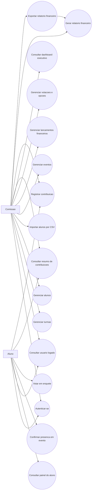

# Diagrama de Casos de Uso

Este documento resume os principais casos de uso reais do sistema com base
nos controllers expostos atualmente no backend.

Arquivos-fonte:

- `diagramas/casos-de-uso.mmd`

## Atores

- `Comissao`
- `Aluno`

## Diagrama

## Casos de uso por ator

### Comissao

- autenticar-se no sistema;
- consultar o usuario logado;
- cadastrar, editar, listar e excluir turmas;
- cadastrar, editar, importar e excluir alunos;
- cadastrar, editar, listar e excluir eventos;
- cadastrar, editar, listar e excluir lancamentos financeiros;
- cadastrar, editar, listar e excluir votacoes;
- adicionar opcoes de votacao;
- consultar dashboard executivo;
- consultar resumo de contribuicoes por turma ou consolidado;
- registrar contribuicoes;
- gerar relatorio financeiro filtrado;
- exportar relatorio em PDF ou CSV.

### Aluno

- autenticar-se no sistema;
- consultar o proprio perfil autenticado;
- consultar o painel do aluno;
- confirmar presenca em evento da propria turma;
- votar em enquete da propria turma;
- consultar resumo de contribuicoes da propria turma;
- registrar contribuicao para a propria turma.

## Relacao com os controllers

- `AuthController` e `ContaController`: autenticacao e identificacao do usuario.
- `CadastroController`: operacoes administrativas de cadastro.
- `DashboardController`: dashboard executivo.
- `ContribuicaoController`: resumo e registro de contribuicoes.
- `RelatorioFinanceiroController`: geracao e exportacao de relatorios.
- `AlunoPortalController`: painel consolidado do aluno.
- `PresencaEventoController`: confirmacao de presenca.
- `VotacaoSeguraController`: voto do aluno autenticado.

## Observacoes

- O ator externo "apoiador" nao aparece como ator do sistema porque hoje nao
  existe fluxo publico sem autenticacao para registrar contribuicao.
- `Tarefa` existe no dominio e no banco, mas ainda nao participa de um caso de
  uso completo pela interface atual.
